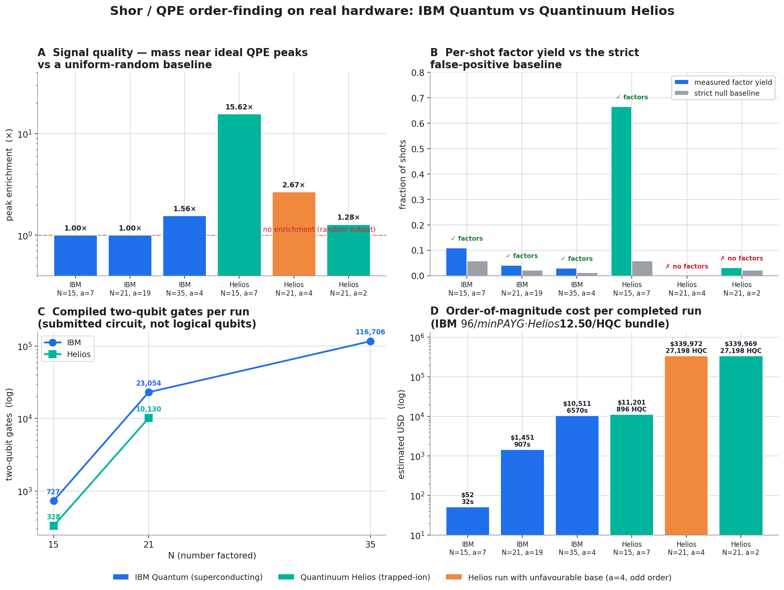
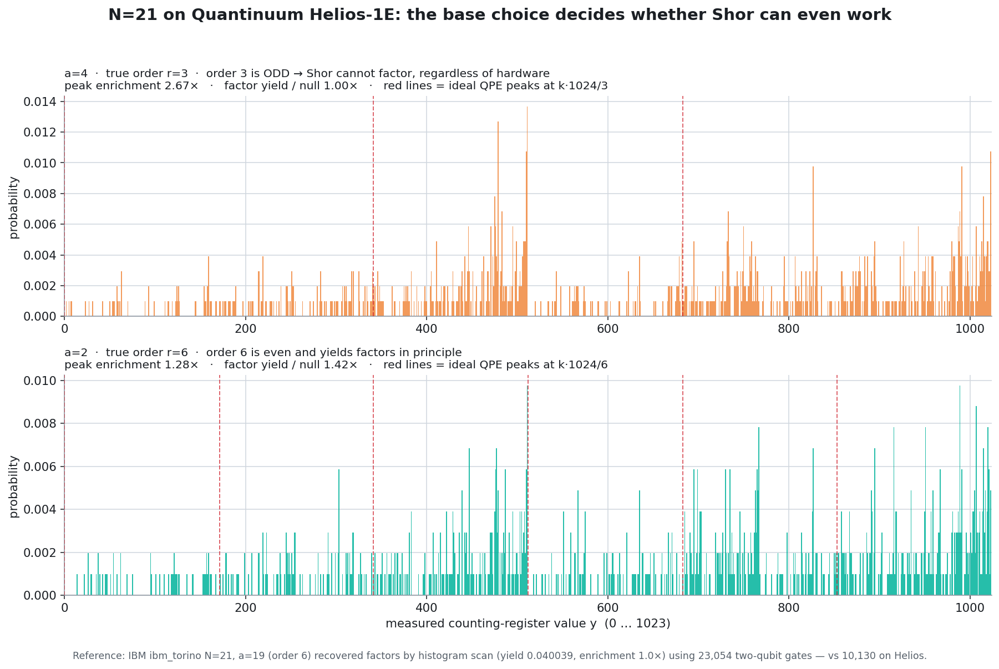

# Sometimes Too Slow for Shor: Running Shor's Algorithm on IBM Quantum and Quantinuum Helios

*An end-to-end account of factoring small numbers with quantum phase estimation on two very different quantum computers — what we built, how we ran it, what came back, and how we judged whether it actually worked.*

*Last updated 2026-06-21.*

---

## TL;DR

We implemented textbook Shor order-finding (quantum phase estimation, QPE) and ran it on real quantum machines for `N = 15, 21, 35`:

- **IBM Quantum** — superconducting qubits (`ibm_torino`, `ibm_fez`).
- **Quantinuum Helios** — trapped ions (`Helios-1`, and the `Helios-1E` noisy emulator).

We then graded every run with the *same* strict post-processing — not "did a factor appear somewhere," but "does the measured distribution actually carry the period?"

Three findings:

1. **On `N=15`, Quantinuum is in a different league.** Its histogram is sharply peaked on the true QPE phases (`15.6×` enrichment over random); IBM recovers factors only by scanning the histogram, with no real period structure (`1.0×`).
2. **On `N=21`, both machines hit a wall.** The generic oracle compiles to ~10k–23k two-qubit gates. IBM still scrapes factors out by brute force; Quantinuum, even with a *mathematically favorable* base, cannot pull a clean period out of the noise.
3. **The bottleneck is the oracle, not the chip.** A compact hand-built oracle (`N=15`) is cheap and clean; the generic exact-permutation oracle blows up depth and — on Quantinuum — cost (a `N=21` run bills ~`27,200 HQC`, ~30× the `N=15` charge).



---

## 1. The problem

Shor's algorithm factors `N` by finding the **multiplicative order** `r` of a base `a` modulo `N` — the smallest `r` with `a^r ≡ 1 (mod N)`. Once you know `r`, and it is even with `a^{r/2} ≢ −1 (mod N)`, the factors fall out of a classical GCD:

```
p = gcd(a^{r/2} − 1, N),   q = gcd(a^{r/2} + 1, N)
```

The quantum part is *only* the order-finding. We estimate the phase `s/r` of the modular-multiplication operator `U|y⟩ = |a·y mod N⟩` using QPE, measure the counting register, and reconstruct `r` from the measured value with continued fractions.

Two things make this hard in practice, and both show up loudly in our results:

- **The oracle.** Implementing controlled `a^{2^k} mod N` is the expensive part. A hand-specialized oracle (e.g. for `mod 15`) is tiny; a *generic* exact-permutation oracle is correct but explodes into thousands of two-qubit gates.
- **The base.** Not every `a` works. If `r` is odd, or `a^{r/2} ≡ −1`, the GCD step yields only trivial factors — no quantum hardware can fix a bad base. This is why we ran `N=21` twice, with `a=4` and `a=2`.

---

## 2. The circuit

The QPE order-finding circuit (`shor/qpe.py`) is the textbook construction:

```
count : |0…0⟩ ──H^⊗t──●────────────●────────●──── iQFT† ── measure
                       │            │        │
work  : |1⟩    ────────U^(2^0)──U^(2^1)──…──U^(2^{t-1})──────────────
```

- **Counting register** `count`: `t` qubits, Hadamard-initialised, each driving a controlled `U^{2^k}` where `U` is "multiply by `a` mod `N`".
- **Work register** `work`: `n = ⌈log₂N⌉` qubits, initialised to `|1⟩`.
- **Inverse QFT** on the counting register (emitted without final swaps — the bit order is resolved later in post-processing), then measurement of the counting register only.

Register sizes used: `t = 2⌈log₂N⌉` counting qubits, so `(t, n) = (8, 4)` for `N=15`, `(10, 5)` for `N=21`, `(12, 6)` for `N=35`.

The oracle `U` is built by `shor/modexp.py`. For `N=15` we use a hand-built `mod 15` permutation; for `N=21` and `N=35` we fall back to the **exact permutation unitary** — provably correct, deliberately simple, and expensive.

---

## 3. How each machine runs the same circuit

The identical Qiskit circuit takes two different roads to hardware:

| Stage | IBM Quantum | Quantinuum Helios |
|---|---|---|
| Source circuit | Qiskit (`shor/qpe.py`) | same Qiskit circuit |
| Transpilation | Qiskit transpile → ISA gates on the device coupling map | Qiskit → **TKET** (`pytket-qiskit`) → **QIR** (`pytket-qir`, ADAPTIVE profile) |
| Connectivity | limited; router inserts **SWAP networks** | **all-to-all** (trapped ions) — no SWAPs |
| Submission | IBM Runtime `SamplerV2` | Quantinuum **Nexus** `start_execute_job`, HQC-cost-guarded |
| Native 2q gate | `cz` / `ecr` family | `RZZ`, `U1q`, … |
| Billing | wall-clock **runtime × plan rate** | **HQC** ≈ overhead + shot-scaled weighted gate/measurement count |

The compiler difference drives everything downstream. IBM's SWAP routing inflates the two-qubit gate count dramatically as `N` grows. Quantinuum's all-to-all connectivity keeps the same circuit far smaller — but because HQC pricing is *proportional to* gate count, a small circuit is exactly what keeps a Helios run affordable. The generic oracle does not stay small.

> **A note on what "Helios" means here.** The `N=15` (`Helios-1`) and `N=21` (`Helios-1E`) runs are **noisy state-vector emulation** of the Helios system (the job metadata reports `simulator = state-vector, noisy = True`); the IBM runs are physical QPU. The **HQC charges are real**. Where it matters, we say "emulator."

---

## 4. The runs we actually executed

| Provider | System | N | base `a` | true order `r` | depth | 2q gates | runtime | native cost |
|---|---|---:|---:|---:|---:|---:|---:|---:|
| IBM | `ibm_torino` | 15 | 7 | 4 | 2,316 | 727 | 32.4 s | ~$52 |
| IBM | `ibm_torino` | 21 | 19 | 6 | 73,170 | 23,054 | 906.9 s | ~$1,451 |
| IBM | `ibm_fez` | 35 | 4 | 6 | 382,165 | 116,706 | 6,569.7 s | ~$10,511 |
| Helios | `Helios-1` (emu) | 15 | 7 | 4 | 840 | 328 | 5,673 s | 896 HQC |
| Helios | `Helios-1E` (emu) | 21 | 4 | **3 (odd)** | 30,008 | 10,130 | 23,530 s | 27,198 HQC |
| Helios | `Helios-1E` (emu) | 21 | 2 | 6 | 30,017 | 10,130 | 15,865 s | 27,198 HQC |

All runs used 1,024 shots. The new `N=21, a=2` Helios run is Nexus job `e03104e4-5a1c-46bb-aa89-5ed28a559f55`.

USD figures are order-of-magnitude only: IBM at `$96/min` Pay-As-You-Go; Helios HQC is a real charge (a bundle-implied `$12.50/HQC` would put each `N=21` run near `$340k`, which is why the exact oracle is impractical, not a Helios quote).

---

## 5. The post-processing: how we decided a run "worked"

This is the heart of the study. A factor showing up *somewhere* in 1,024 shots is a weak claim — with enough shots and a lenient scan, randomness alone finds factors sometimes. So we grade every run on four layers (`shor/postprocess.py`, `experiments/analyze_results.py`), applied identically to both providers.

**1. Strict per-shot recovery (`strict_postprocess_y`).** For each measured value `y`, form the phase `φ = y / 2^t`, take its continued-fraction convergents with denominator `≤ N`, keep only those matching the phase to within `1/2^{t+1}`, verify `a^r ≡ 1 (mod N)`, reduce to the minimal order, and attempt the GCD. Conservative by construction — no "try every denominator until something works."

**2. The strict null baseline (`strict_null_baseline_fp_rate`).** Run that *same* strict pipeline on uniformly random `y`. This is the false-positive rate: how often strict post-processing "succeeds" on pure noise. A run is only meaningful if its **factor yield beats this baseline**.

**3. Per-shot factor yield (`per_shot_factor_yield`).** The fraction of *all* shots (not just the lucky top one) that factor under strict post-processing — and whether the single most-likely outcome (top-1) factors. Yield divided by the null baseline is our signal-to-noise number.

**4. Ideal-peak enrichment (`histogram_vs_ideal_overlap`).** Independently of factoring, QPE for order `r` should pile probability at `y ≈ round(s·2^t / r)`. We measure how much mass lands within ±1 bin of those ideal peaks and divide by the uniform-random expectation. **`1.0×` means the distribution is statistically indistinguishable from noise near the peaks; `>1` means real period structure.** (Because the inverse QFT is emitted without swaps, we evaluate both bit orders and keep the better one.)

The distinction these layers enforce is the whole point:

> "A factor appeared in the histogram" and "the measured distribution clearly contains the period" are different claims. The first can happen by chance; the second is what QPE is supposed to deliver.

---

## 6. Results

### 6.1 N=15 — a clean win for Quantinuum

Here the oracle stays small (`mod15`: 328 two-qubit gates on Helios vs 727 on IBM), and the output quality diverges sharply:

| Metric | IBM `ibm_torino` | Helios-1 | What it means |
|---|---:|---:|---|
| Strict factor yield | 0.108 | **0.665** | 6.1× more shots factor on Helios |
| Yield ÷ strict null | 1.88× | **11.54×** | Helios separates far more cleanly from noise |
| Mass near ideal peaks | 0.047 | **0.732** | IBM ≈ uniform; Helios concentrates on the QPE phases |
| **Peak enrichment** | **1.00×** | **15.63×** | IBM: no period structure. Helios: unmistakable |
| Top-1 outcome factors? | No | **Yes** | Helios' single likeliest result already factors |

IBM's `N=15` run is real but weak: factors are recoverable by scanning, yet the distribution itself carries no detectable period (`1.0×`). Helios' run is qualitatively different — peaked, top-1-correct, two-thirds yield. The cost of that quality: 5,673 s of emulation and 896 HQC, versus IBM's 32 s of QPU time.

### 6.2 N=21 — the wall, and why the base decides everything



At `N=21` the generic oracle compiles to ~10k two-qubit gates and depth ~30k on Helios. We ran it twice, isolating two distinct failure modes.

**`a=4` — the wrong base (mathematically dead on arrival).** The order of `4 mod 21` is **3**, which is *odd*. Shor's `a^{r/2}±1` step needs an even order, so this base **cannot** factor `N=21` on *any* hardware. The run did show weak order-3 structure (2.67× enrichment, all 3 ideal peaks present), but zero factors is the correct, expected outcome. A clean worked example that base selection is part of the algorithm, not a hardware property.

**`a=2` — the right base, but the signal drowns.** The order of `2 mod 21` is **6** (even), and `gcd(2^3 ± 1, 21) = {7, 3}` — a textbook factor-yielding base. It *should* work. On Helios-1E it did not: factor yield `0.031` (just `1.42×` the null), peak enrichment `1.28×` — essentially noise. There is a visible spike at `y=512` (the `s=3` peak), but the depth-30k circuit washes out everything else.

For reference, IBM's `N=21, a=19` (also order 6) *did* clear strict success — but only by top-k histogram scanning, with its own peak enrichment at `1.0×` (no genuine period structure either), and it needed **23,054** two-qubit gates to do it.

The honest read of `N=21`:

> Neither machine produces a genuine period signal at `N=21` with the generic oracle. IBM recovers factors by brute-force scanning; Quantinuum does not. Both are below the threshold where the QPE distribution is meaningfully period-structured.

### 6.3 N=35 — IBM completes, Quantinuum prices itself out

IBM completed `N=35` on `ibm_fez` (116,706 two-qubit gates, 6,570 s, factors recovered by scan, enrichment 1.56×). The Quantinuum exact-oracle path for `N=35` was never successfully executed: its circuit is ~5× the `N=21` volume, which extrapolates to ~`130,000–150,000 HQC` — economically impractical, and its server-side cost estimation failed outright.

---

## 7. The two economies of cost

**Two-qubit gates vs N (Panel C of the hero figure).** IBM's routed circuits balloon: `727 → 23,054 → 116,706` for `N = 15 → 21 → 35`. Quantinuum's all-to-all connectivity keeps the same circuits far smaller (`328`, `10,130`). On raw gate count, Quantinuum wins decisively.

**But HQC is priced on that gate count.** Quantinuum's documented model is roughly:

```
HQC ≈ 5 + C · (N_1q + 10·N_2q + 5·N_meas) / 5000     (per shot batch)
```

So the very efficiency that makes Helios circuits small is what you pay for:

| Run | 2q gates | HQC charged | ≈ USD scale* |
|---|---:|---:|---:|
| Helios `N=15`, `a=7` | 328 | 896 | ~$11,200 |
| Helios `N=21`, `a=4` | 10,130 | 27,198 | ~$340,000 |
| Helios `N=21`, `a=2` | 10,130 | 27,198 | ~$340,000 |

\*Azure H2 bundle-implied `$12.50/HQC`, order-of-magnitude scale only — not a Helios quote.

The `N=21` charge is ~30× the `N=15` charge, tracking the ~31× jump in two-qubit gates. **IBM's billing is wall-clock**, so at these scales it is far cheaper (`~$52 / ~$1,451 / ~$10,511`); IBM's wall is *time and fidelity*, not credits.

---

## 8. What is best at what

| Dimension | Winner | Why |
|---|---|---|
| Signal quality with a compact oracle (`N=15`) | **Quantinuum** | 15.6× enrichment, top-1 factors, 2/3 yield |
| Two-qubit gate efficiency | **Quantinuum** | all-to-all connectivity, no SWAP networks |
| Cost at small scale | **IBM** | ~$52 vs 896 HQC for the same `N=15` |
| Completing a run at larger `N` | **IBM** | `N=21` and `N=35` both finished |
| Clean period recovery at `N=21` | **Neither** | both below the period-signal threshold |
| Base / algorithm hygiene | **N/A** | `a=4` failing on `N=21` is math, not hardware |

The cross-cutting lesson: **the limiting factor is the oracle compilation, not the chip.** Quantinuum's hardware is clearly capable (see `N=15`), but the generic exact-permutation oracle expands into a circuit whose depth destroys the signal and whose HQC cost destroys the budget. A compact, specialized oracle is what unlocks the trapped-ion advantage; without it, `N=21` is a wall on both machines.

---

## 9. Reproducing the study

All commands from `sometimes-too-slow-for-shor/`.

**IBM sweep & analysis:**
```bash
python experiments/run_sweep.py            # submit IBM hardware runs
python experiments/analyze_results.py      # strict metrics + IBM figures
```

**Quantinuum Helios sweep:**
```bash
python quantinuum_helios/run_helios_sweep.py --target Helios-1 --shots 1024
```

**Fetch the finished N=21, a=2 Helios job and grade it:**
```bash
python quantinuum_helios/fetch_helios_job_result.py \
  --job-id e03104e4-5a1c-46bb-aa89-5ed28a559f55 \
  --N 21 --base 2 --shots 1024 \
  --template quantinuum_helios/data/raw/results_helios_hardware_N21_Helios-1E_20260620_retry.jsonl \
  --submission quantinuum_helios/data/submissions/submit_N21_a2_Helios-1E_20260620.json \
  --output quantinuum_helios/data/raw/results_helios_hardware_N21_a2_Helios-1E_20260620.jsonl

python quantinuum_helios/analyze_helios_results.py \
  --input quantinuum_helios/data/raw/results_helios_hardware_N21_a2_Helios-1E_20260620.jsonl \
  --output-csv quantinuum_helios/data/summary/results_summary_helios_N21_a2_Helios-1E_20260620.csv \
  --figures-dir quantinuum_helios/figures/N21_a2
```

**Build the consolidated comparison figures + table:**
```bash
python quantinuum_helios/generate_full_comparison.py
```

### Key artifacts

| Path | What |
|---|---|
| `quantinuum_helios/comparison/hero_hardware_comparison.png` | 4-panel overview (signal, yield, gates, cost) |
| `quantinuum_helios/comparison/n21_base_comparison.png` | `N=21` base/period deep dive |
| `quantinuum_helios/comparison/full_hardware_comparison.csv` | one row per completed run |
| `data/summary/results_summary.csv` | IBM strict metrics |
| `quantinuum_helios/data/summary/results_summary_helios_*.csv` | Helios strict metrics |
| `quantinuum_helios/figures/ideal_overlay_N15_a7.png` | Helios `N=15` peak overlay |

---

## 10. Pricing & reference links

- IBM Quantum pricing — https://www.ibm.com/quantum/products
- IBM cost-limit docs — https://quantum.cloud.ibm.com/docs/guides/manage-cost
- Quantinuum HQC workflow — https://docs.quantinuum.com/systems/user_guide/hardware_user_guide/workflow.html
- Helios costing — https://docs.quantinuum.com/systems/trainings/helios/getting_started/costing.html
- Azure Quantinuum bundle pricing (USD/HQC scale only) — https://learn.microsoft.com/en-us/azure/quantum/pricing

---

*Methodology footnote: every run is graded by `shor/postprocess.py` (`strict_postprocess_y`, `strict_null_baseline_fp_rate`, `per_shot_factor_yield`, `histogram_vs_ideal_overlap`) via `experiments/analyze_results.py`. No threshold is relaxed between providers. The `dominant_outcome_success` heuristic (yield ratio > 1.5×, enrichment > 2.0×) is a screening filter, not a mathematically derived bound, and is reported as such.*
