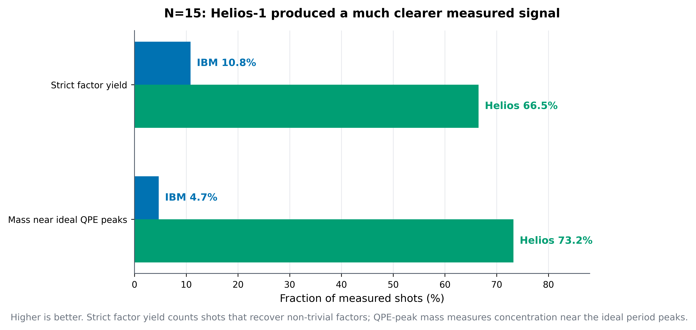
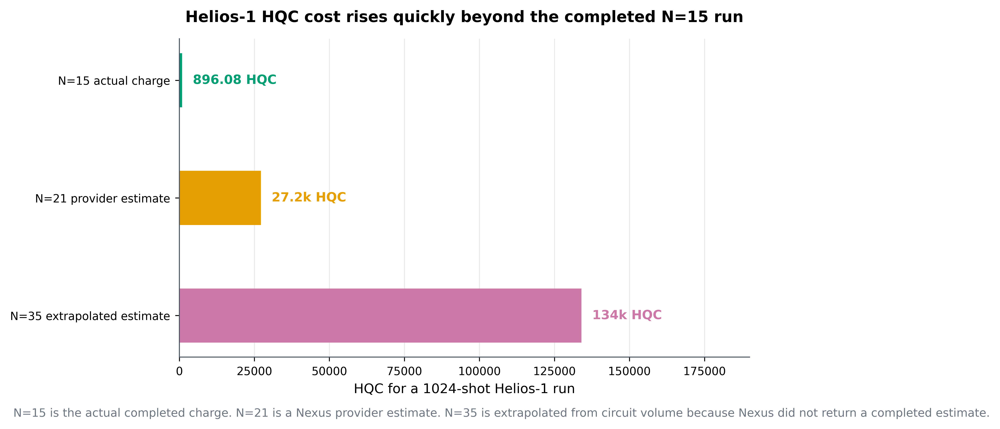
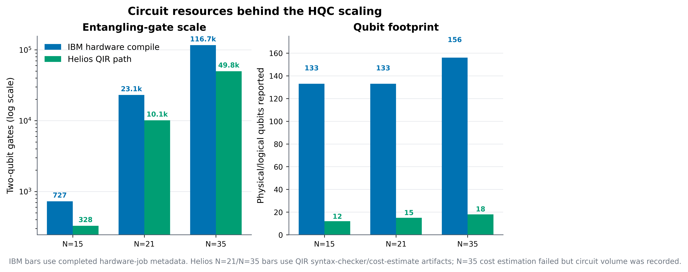

# IBM Quantum vs Quantinuum Helios-1: Hardware Comparison

This note compares the original IBM Quantum hardware results from the Shor sweep with the Quantinuum Helios-1 experiments in this folder. The comparison uses the same strict post-processing framework as the original project: top-1 success, per-shot factor yield, false-positive baseline, and ideal-peak enrichment.

The main conclusion is deliberately narrow:

> Helios-1 produced a substantially cleaner `N=15` Shor/QPE signal than the IBM hardware run. For `N=21` and `N=35`, IBM has completed hardware rows, while Helios-1 did not return completed shot histograms under the runs attempted here.

That distinction matters. The `N=15` result is a genuine cross-provider comparison. The larger cases are not yet completed Helios comparisons.

## Data Sources

IBM hardware summary:

- `../data/summary/results_summary.csv`
- Completed hardware rows: `N=15`, `N=21`, `N=35`

Helios-1 hardware summaries:

- `data/summary/results_summary_helios_full_20260619.csv`
- `data/summary/results_summary_helios_N21_20260619_max6500.csv`
- `data/cost_estimates/helios_qir_cost_N21_1024shots_20260620_002436.json`
- `data/cost_estimates/helios_qir_cost_N35_1024shots_20260620_001742.json`
- Completed hardware rows: `N=15`
- Attempted but not completed: `N=21`, `N=35`

The completed apples-to-apples overlap is:

| Parameter | Value |
|---|---:|
| `N` | `15` |
| base `a` | `7` |
| counting register `t` | `8` |
| requested shots | `1024` |

## Completed N=15 Comparison

| Metric | IBM Torino | Helios-1 | Interpretation |
|---|---:|---:|---|
| Circuit depth | `2316` | `840` | Helios path was about `2.8x` shallower |
| Two-qubit gates | `727` | `328` | Helios path used about `2.2x` fewer two-qubit gates |
| Top-1 success | `False` | `True` | Helios' dominant measured outcome factored |
| Strict factor yield | `0.1084` | `0.6650` | Helios produced about `6.1x` higher strict factor yield |
| Yield / strict null baseline | `1.88x` | `11.54x` | Helios separated much more strongly from random post-processing |
| Mass near ideal peaks | `0.0469` | `0.7324` | IBM was close to the uniform expectation; Helios concentrated near QPE peaks |
| Peak enrichment | `1.00x` | `15.63x` | Helios showed clear period structure |
| Dominant outcome success | `False` | `True` | Helios passed the strongest project label |
| Recorded runtime | `32.4s` | `5673s` | Helios took much longer end-to-end |
| Quantinuum cost | n/a | `896.08 HQC` | IBM and Quantinuum billing are not directly comparable |



The signal-quality result is the most important part of the comparison. The IBM `N=15` run found factors somewhere in the histogram, but the distribution itself was not strongly period-like: peak enrichment was `1.00x`, which means the observed mass near ideal peaks was essentially what a uniform random distribution would provide.

The Helios-1 run is qualitatively different. The top measured outcome factored, the strict factor yield was above `66%`, all ideal peaks were hit, and peak enrichment was above `15x`. Under the project's own strict metrics, this is a genuine QPE signal rather than merely a successful histogram scan.

The resource comparison is mixed. The Helios route produced a smaller circuit by the recorded depth and two-qubit gate metrics, but the end-to-end execution took much longer. The Helios runtime includes Nexus submission, hardware queueing/execution, result retrieval, and QIR workflow overhead; it should not be interpreted as pure gate time.

## Larger-N Status



The HQC jump is mainly a circuit-volume effect. Quantinuum defines HQC usage from a fixed job overhead plus a shot-count-scaled weighted sum of one-qubit gates, two-qubit gates, and measurement/SPAM operations. In simplified form, the documented model is `HQC = 5 + C * (N_1q + 10 N_2q + 5 N_m) / 5000`, with Helios adding dynamic-cost behavior for programs with branches. The `N=15` run used the hand-specialized `mod15` oracle, so the submitted QIR path had only `328` two-qubit gates and charged `896.08 HQC`. The `N=21` and `N=35` runs used the exact permutation-oracle fallback, which is intentionally clear but expensive: `N=21` compiled to `10130` two-qubit gates and received a `27198 HQC` syntax-checker estimate; `N=35` compiled to `49812` two-qubit gates, and its direct syntax-checker cost job failed, so the current `134k HQC` number is extrapolated from the observed circuit-volume scaling.



The resource comparison also explains why the two providers should not be compared only by qubit count. IBM used the full hardware backend footprint reported by the runtime metadata (`133` qubits on `ibm_torino` for `N=15`/`N=21`, and `156` on `ibm_fez` for `N=35`). The Helios QIR programs used many fewer logical/physical qubits in the submitted circuit (`12`, `15`, and `18` respectively), but the exact-oracle decomposition still produced tens of thousands of entangling gates for the larger cases.

IBM completed all three original hardware experiments:

| `N` | IBM backend | IBM status | IBM strict yield | IBM dominant outcome success |
|---:|---|---|---:|---|
| `15` | `ibm_torino` | completed | `0.1084` | `False` |
| `21` | `ibm_torino` | completed | `0.0400` | `False` |
| `35` | `ibm_fez` | completed | `0.0293` | `False` |

Helios-1 completed only `N=15`:

| `N` | Helios status | Notes |
|---:|---|---|
| `15` | completed | Strong signal; `896.08 HQC` charged |
| `21`, `a=19` | rejected before execution | Provider estimate exceeded available credits under automatic guard |
| `21`, `a=4` | terminated | Accepted with `6500 HQC` cap, then terminated with no shot outputs; `28.08 HQC` charged |
| `35`, `a=4` | not submitted successfully | QIR cost estimation failed server-side; Helios refused execution without max-cost |

This means the current evidence supports a strong statement for `N=15`, but not for `N=21` or `N=35`. For those larger cases, the limiting factor was not post-processing; it was execution cost and provider-side job acceptance.

## HQC Budget Required for N=21 and N=35

The table below separates provider estimates from extrapolations.

| Experiment | 1024-shot HQC estimate | Evidence level | Practical max-cost guard |
|---|---:|---|---:|
| `N=15`, `a=7` | `897 HQC` estimated, `896.08 HQC` charged | observed provider estimate and completed run | `~1100 HQC` was sufficient |
| `N=21`, `a=19` | `27198 HQC` | Helios syntax-checker estimate, `95%` confidence | at least `~28000 HQC`; safer `~32000-34000 HQC` |
| `N=21`, `a=4` | `27198 HQC` | provider estimate from Nexus cost check | at least `~28000 HQC`; safer `~32000-34000 HQC` |
| `N=35`, `a=4` | roughly `130000-150000 HQC` | extrapolated; syntax-checker cost jobs failed | likely `~160000 HQC` or more |

For `N=21`, the requirement is relatively clear: Nexus returned `27198 HQC` for the 1024-shot QIR program. A `6500 HQC` cap was too low. The job object was accepted, but the program was terminated before any shot outputs were produced. A successful 1024-shot `N=21` run should be budgeted at no less than the provider estimate, and in practice should use a guard above it, for example `32000-34000 HQC`.

For `N=35`, Nexus did not return a successful cost estimate. I tested both a 1024-shot cost check and a 1-shot diagnostic cost check through the Helios syntax-checker path (`Helios-1SC`). Both failed server-side with `requests.exceptions.JSONDecodeError: Expecting value: line 1 column 1 (char 0)`. The recorded costing job references were:

- 1024 shots: `7a7bcc83-a4c0-4ebf-b27d-1530811bf84c`
- 1 shot: `38624508-b7bd-4371-955c-e49eae56e35e`

The `130000-150000 HQC` figure is therefore still an extrapolation from the recorded compiled QIR circuit size:

- `N=21`: depth about `30017`, two-qubit gates about `10130`, estimate `27198 HQC`
- `N=35`: depth about `147263`, two-qubit gates about `49812`

The `N=35` circuit is about `4.9x` larger than the `N=21` circuit by both depth and two-qubit gate count. Multiplying the `N=21` estimate by this factor gives about `134000 HQC`. Because this is not a provider quote, the honest planning number is an order-of-magnitude budget: approximately `130000-150000 HQC`, with a practical max-cost guard likely closer to `160000 HQC` or higher.

One subtle but important point: a max-cost guard is not the same as actual cost. The `N=21, a=4` attempt used a `6500 HQC` cap but charged only `28.08 HQC` before termination. Conversely, the completed `N=15` run demonstrates that the Nexus estimate can be accurate: `897 HQC` estimated versus `896.08 HQC` charged.

## Illustrative USD Cost

The USD comparison below is approximate and should not be read as a provider invoice. IBM publishes public plan prices by runtime minute: Pay-As-You-Go starts at `$96/min`, Flex at `$72/min`, and Premium at `$48/min`. Quantinuum's public documentation defines HQCs, but public Helios Pay-As-You-Go USD/HQC pricing is not listed; Microsoft Azure's published Quantinuum H2 subscription bundles imply rough rates of `$12.50/HQC` for the Standard bundle (`$125000` for `10000 HQCs`) and about `$10.29/HQC` for the Premium bundle (`$175000` for `17000 HQCs`). H2 bundle economics are not the same thing as a quoted Helios price, so the Quantinuum dollar values are only scale estimates.

IBM hardware cost at public IBM runtime rates:

| `N` | IBM runtime | Pay-As-You-Go `$96/min` | Flex `$72/min` | Premium `$48/min` |
|---:|---:|---:|---:|---:|
| `15` | `32.4s` | `$51.84` | `$38.88` | `$25.92` |
| `21` | `906.9s` | `$1451.07` | `$1088.30` | `$725.53` |
| `35` | `6569.7s` | `$10511.48` | `$7883.61` | `$5255.74` |

Illustrative Quantinuum conversion using Azure H2 bundle-implied USD/HQC:

| `N` | HQC basis | At `$12.50/HQC` | At `$10.29/HQC` |
|---:|---:|---:|---:|
| `15` | `896.08 HQC` actual charge | `$11201.00` | `$9224.35` |
| `21` | `27198 HQC` syntax-checker estimate | `$339975.00` | `$279979.41` |
| `35` | `134000 HQC` extrapolated | `$1675000.00` | `$1379411.76` |

The main value of this table is not the exact dollar amount; it is the scale. On this implementation, the Helios `N=15` result was scientifically much cleaner, but the exact-oracle path becomes economically impractical quickly unless the oracle construction is made much smaller.

## Interpretation

The `N=15` comparison changes the qualitative story. The IBM result was factorable by scanning the histogram, but it did not show a strong period-distribution signature. The Helios result did: top-1 success, high strict yield, strong separation from the null baseline, and high mass near ideal QPE peaks.

For the article series, this is the main point:

> "Factors found somewhere in the histogram" and "the quantum distribution clearly contains the period" are not the same claim.

On `N=15`, Helios-1 satisfies the stronger claim under the metrics used here.

For `N=21` and `N=35`, the current conclusion is not that Helios fails algorithmically. The available runs show that the exact-oracle QIR workflow becomes expensive very quickly. A fair larger-N comparison likely requires at least one of the following:

- More HQC budget, especially for `N=21`.
- A smaller shot count for exploratory data.
- A more compact oracle construction.
- Provider-native compilation support that avoids the current Qiskit-to-TKET-to-QIR expansion.
- A narrower experiment focused on cost-estimation and circuit-volume scaling before committing to hardware shots.

## Suggested Article Framing

A professional title could be:

> Revisiting "Too Slow for Shor" on Quantinuum Helios-1: A Cleaner N=15 Signal, but N=21 Still Hits the Cost Wall

Recommended narrative:

1. The IBM hardware runs established a useful baseline: factorable histograms, but weak period-structure diagnostics.
2. Helios-1 substantially improves the completed overlapping `N=15` case.
3. The larger Helios experiments are currently limited by execution cost and QIR circuit expansion.
4. The right metric is not simply whether factors can be recovered; it is whether the measured distribution is enriched over a random-output baseline and aligned with ideal QPE peaks.

## Pricing References

- IBM Quantum product pricing: https://www.ibm.com/quantum/products
- IBM Quantum cost-limit documentation: https://quantum.cloud.ibm.com/docs/guides/manage-cost
- Quantinuum HQC workflow documentation: https://docs.quantinuum.com/systems/user_guide/hardware_user_guide/workflow.html
- Quantinuum Helios costing documentation: https://docs.quantinuum.com/systems/trainings/helios/getting_started/costing.html
- Azure Quantum provider pricing for Quantinuum H2 bundles: https://learn.microsoft.com/en-us/azure/quantum/pricing

## Reproducing the Comparison Plots

From `sometimes-too-slow-for-shor/`:

```bash
/Users/monitsharma/medium_articles/.venv/bin/python quantinuum_helios/generate_paper_figures.py
/Users/monitsharma/medium_articles/.venv/bin/python quantinuum_helios/generate_ibm_comparison.py
```

This writes:

- `paper_figures/fig1_paper_n15_hardware_comparison.png`
- `paper_figures/fig1_paper_n15_hardware_comparison.pdf`
- `paper_figures/fig1_paper_n15_hardware_comparison.svg`
- `paper_figures/fig2_paper_scaling_budget.png`
- `paper_figures/fig2_paper_scaling_budget.pdf`
- `paper_figures/fig2_paper_scaling_budget.svg`
- `paper_figures/fig3_paper_resource_scale.png`
- `paper_figures/fig3_paper_resource_scale.pdf`
- `paper_figures/fig3_paper_resource_scale.svg`
- `comparison/comparison_table.csv`
- `comparison/fig1_n15_signal_quality.png`
- `comparison/fig2_n15_resources_runtime.png`
- `comparison/fig3_factor_yield_by_n.png`
- `comparison/fig4_helios_cost_attempts.png`
- Matching vector PDFs for each figure, useful for publication workflows.
